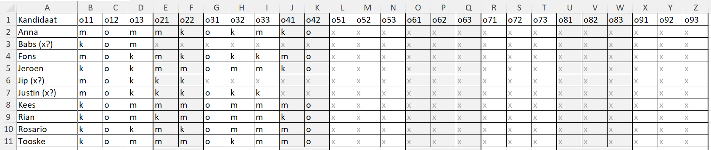
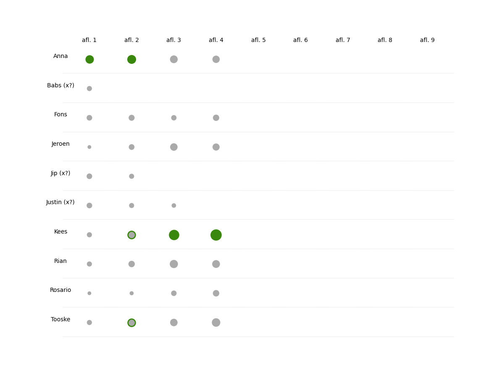
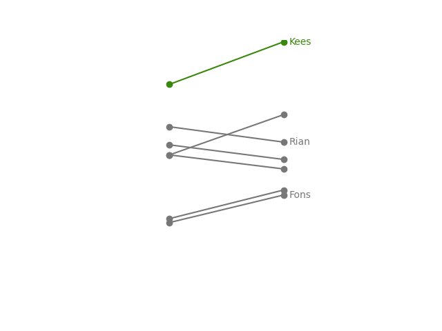
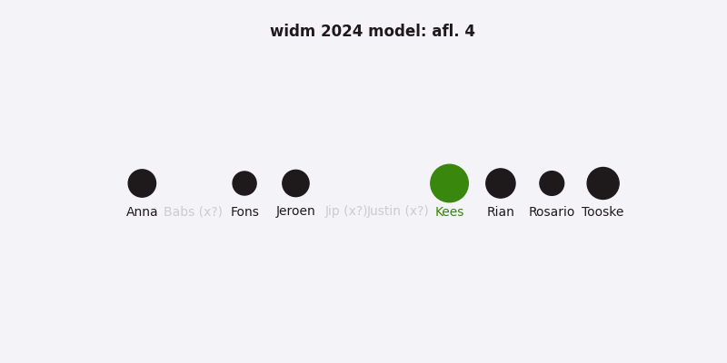

# Wie is de Mol? Bayes Model (codeerik)
Dit "Wie is de Mol?" model is gebaseerd op [de stelling van Bayes](https://nl.wikipedia.org/wiki/Theorema_van_Bayes). Het model past deze stelling toe op observaties van opdrachten. Per opdracht die meetelt in het model, past het model de molkans van de spelers aan.

Deze documentatie gaat in op:

1. Theorie
2. Input data
3. Analyse
4. Visualisaties

Laten we erin duiken.

## 1: Theorie

De stelling van Bayes gaat uit van een startgeloof (een *prior belief*). Je weet dat dit geloof niet perfect is, dus ga je dit startgeloof aanpassen o.b.v. observaties. Bij elke observatie bepaal je twee kansen:

- De kans dat het je geloof bevestigt.
- De kans dat het je geloof ontkracht. 

Is de eerste kans groter dan de tweede, dan gaat de kans die je had (je startgeloof) omhoog. Is de tweede kans groter? Dan volgt een correctie omlaag. 

Als we de mol willen vinden, onderzoeken we de vraag: wie is de mol? Het startgeloof voor dit onderzoek is daarmee de molkans. Een deel van de opdrachten vertelt ons iets over die molkans. Hoe je die informatie kan omzetten tot informatie voor het model, lees je hieronder.

### Molkansen

Als het seizoen start, is de molkans voor iedere speler gelijk. Bij tien spelers is dit 1/10. 

Dan start het seizoen.

De mol heeft voorkennis. De mol weet wat er in een seizoen gaat gebeuren. En mijn model poogt de persoon met die voorkennis boven water te halen. Het doet dit o.b.v. opdrachten. Bij sommige opdrachten splitsen de spelers op in groepen én heeft een van de groepen meer invloed op de uitkomst van het spel dan de andere. Ik probeer dit voor iedere opdracht zo objectief mogelijk te bepalen. 

De mol zal niet altijd in de groep met de meeste macht zitten, maar wel vaker dan een kandidaat. Over tijd komt de mol zo naar boven. 

Een bijkomend voordeel van de Bayes benadering: maak je een foute interpretatie van een opdracht, dan zal de invloed van die fout over tijd verwateren. Zo kwam bij mij in 2023 Jurre in aflevering 4 naar boven i.p.v. 2 (als ik alles goed had ingeschat). 

### Voorbeeld

Stel dat de groep 10 spelers bevat en bij een opdracht in twee groepen van 5 splitst. Een van de groepen heeft vervolgens de meeste macht. Dan zijn er twee manieren waarop het model de molkans van spelers aanpast:

- **Spelers Groep Mol**
  - Molkans: 1/5
  - Kandidaatkans: 1/9
- **Spelers Groep Niet Mol** (waarschijnlijk)
  - Molkans: 1/10 
  - Kandidaatkans: 1/9

Zoals je ziet, is de kandidaatkans voor beide groepen gelijk en gebaseerd op het totale aantal spelers min de mol (10-1=9). De molkans varieert o.b.v. de grootte van de molgroep of de grootte van de totale groep.

Met deze opzet ontstaat het Mol-Driessen-Bayes (😉) systeem dat twee correcties op de molkans door kan voeren:

- **Correctie omhoog**: zit de speler <u>*wel*</u> in de molgroep, dan gaat de kans omhoog. De correctie is afhankelijk van de grootte van de molgroep (kleinere groep = grotere correctie).
- **Correctie omlaag**: zit de speler <u>*niet*</u> in de molgroep, dan gaat de kans iets omlaag. Deze correctie is altijd gebaseerd op de grootte van de groep spelers. 

## 2: Input data

Je voedt het model met observaties. In `input_data` staat een voorbeeld van de observaties van 2024:

- De eerste kolom `Kandidaat` bevat de namen van de spelers.
- Alle volgende kolommen bevatten de observaties per opdracht. Het format is o + afleveringsnummer + opdrachtnummer. Voorbeeld: de kolom `o23` staat voor aflevering 2, opdracht 3. *Let op: houd exact dit format aan, omdat het model hier de afleveringen en opdrachten op baseert.*

Je geeft hier per kandidaat, per opdracht, je observaties aan:

- m = speler zat in molgroep
- k = speler zat niet molgroep (kandidaat)
- o = opdracht overslaan
- x = persoon is afgevallen

Je kan de molkans ook andersom corrigeren. Dit heb ik vorig jaar toegevoegd toen één speler binnen een groep spelers zeker een rood scherm had wat niet getoond werd:

- a = speler zat in de afvalgroep, de groep waar zeker een rood scherm tussen zat
- k = speler zat niet in de afvalgroep

In dit geval vindt een correctie omlaag plaats als de speler in de `a` groep zat. Je kan er voor kiezen om dit niet toe te passen. Gebruik in dat geval `o` voor overslaan.

Hieronder staat een voorbeeld van seizoen 2024, bijgewerkt t/m aflevering 4. 



## 3: Analyse

Heb je de observaties van een aflevering toegevoegd? Dan kan je de analyse uitvoeren. In `main.py` staat een voorbeeld. De analyse bestaat uit drie stappen:

1. Data inladen
2. Data analyseren
3. Output opslaan (optioneel)

Je hebt bij stap 2 de optie om een `debug_player` aan te geven. Doe je dat, dan print het project de molkansontwikkeling per opdracht.

``````python
df_observations = pd.read_excel(
    'input_data/2024 widm observations.xlsx',
    index_col='Kandidaat'
)

player_data = get_season_data_by_max_episode(
    season_data=df_observations,
    max_episode=9,
    # debug_player='Kees',
)

new_df = pd.DataFrame(player_data)
new_df.transpose().to_excel('output_data/2024_codeerik_results.xlsx')
``````

## 4: Visualisaties

Er zijn drie type visualisaties die je met het project kan genereren. Je vindt de code voor alle drie terug in `main.py`. 

### 4.1 Algemene molkansontwikkeling

Toon de molkansen per speler per aflevering met bolletjes. De speler (of spelers) met de grootste molkans in een aflevering kleurt groen. Spelers die die maximaal 20% lager zitten krijgen een groene rand (zie Kees en Tooske in aflevering 2).

``````python
plot_player_data(
    player_data=player_data,
    file_name='plots/2024_results_ep4.png',
)
``````

Voorbeeld:



De afbeeldingen vind je terug in de map `plots/...`

### 4.2 Slope chart van aflevering X naar Y

Bekijk de molkansontwikkelingen van aflevering X naar Y in een slopechart. Je geeft heirbij handmatig aan welke spelers je niet wil meenmen, op wie je wilt focussen (die wordt groen), en welke labels je rechts wil toevoegen.

```python
plot_player_dev(
    player_data=player_data,
    start_ep=3,
    stop_ep=4,
    focus_player='Kees',
    label_players=['Kees', 'Rian', 'Fons'],
    exclude_players=['Babs (x?)', 'Jip (x?)', 'Justin (x?)'],
    file_name='plots/slopes/2024_ep_2_to_3.png'
)
```

Voorbeeld:



Deze afbeeldingen vind je terug in de map `plots/slopes/...`

### 4.3 Kansen per aflevering

Plot de resultaten per aflevering als een aparte visualisatie met bolletjes. Leuk om bij meerdere afleveringen een geanimeerde GIF van te maken. De parameter `year` wordt hier enkel gebruikt om de afbeeldingen te voorzien van een jaartal. 

`````python
plot_result_per_episode(
    year=2024,
    player_data=player_data
)
`````

Voorbeeld:



Deze afbeeldingen vind je terug in de map `plots/episodes/...`

---

### Vragen, suggesties, ideeën?

Leuk! [Stel ze hier](https://www.codeerik.nl/contact). 

### Met dank aan...

Het is leuk en leerzaam om een stelling als die van Bayes te leren kennen en gebruiken. Maar dat doe je niet alleen. 

- *The Signal and the Noise* van *Nate Silver*: dit boek legt op een begrijpelijk manier uit waarom veel modellen niet werken, maar sommige wel. Het bevat de uitleg van Bayes die mij triggerde om dit model te maken.
- [Nino Weerman, Senior Data Consultant](https://www.linkedin.com/in/ninoweerman/): Nino was zo aardig om mijn model te reviewen. Mede daardoor is het nu een open repo. 
- [Measurecamp Amsterdam](https://amsterdam.measurecamp.org/): de leukste *unconference* over analytics, waar ik in 2022 en 2023 met vakgenoten heb kunnen sparren over mijn model. 


